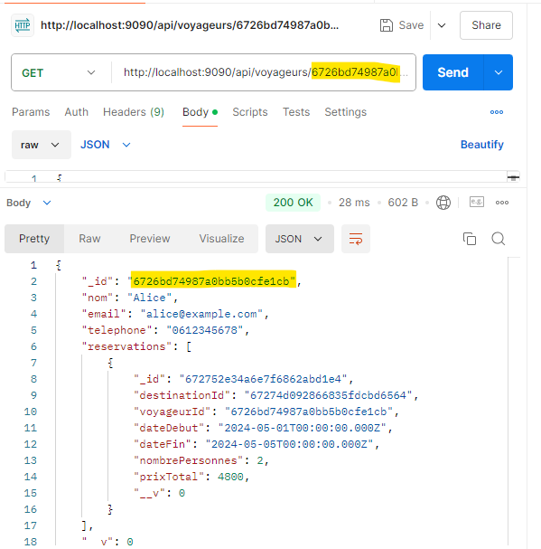

<h1>API REST avec Node.js, Express et MongoDB - Gestion des Voyageurs, Destinations, et Réservations</h1>

<h2>Contexte du projet</h2>

Cette API REST a été développée pour gérer des entités Voyageur, Destination, et Réservation. Elle permet d’effectuer des opérations CRUD sur chaque entité en utilisant Node.js, Express, et MongoDB comme base de données. Ce projet est conçu pour servir de base à des systèmes de réservation de voyage ou de gestion de destinations touristiques.

<h2>Diagramme de classe</h2>

<h2>Liste des Voyageurs</h2>

<h2>Liste des Destinations</h2>

<h2>Liste des Réservations</h2>

<h2>Détails d'un Voyageur spécifique</h2>

<h2>Détails d'une destination spécifique</h2>

<h2>Détails d'une réservation spécifique</h2>

<h2>Création de Données</h2>

<h3>Ajout d'un Voyageur</h3>

<h3>Ajout d'une Destination</h3>

<h3>Ajout d'une Réservation</h3>

<h2>Modification de Données</h2>

<h3>Modification d'un Voyageur</h3>

<h3>Modification d'une Destination</h3>

<h3>Modification d'une Réservation</h3>

<h2>Suppression de Données</h2>
<h3>Suppression d'un Voyageur</h3>

<h3>Suppression d'une Destination</h3>

<h3>Suppression d'une Réservation</h3>

